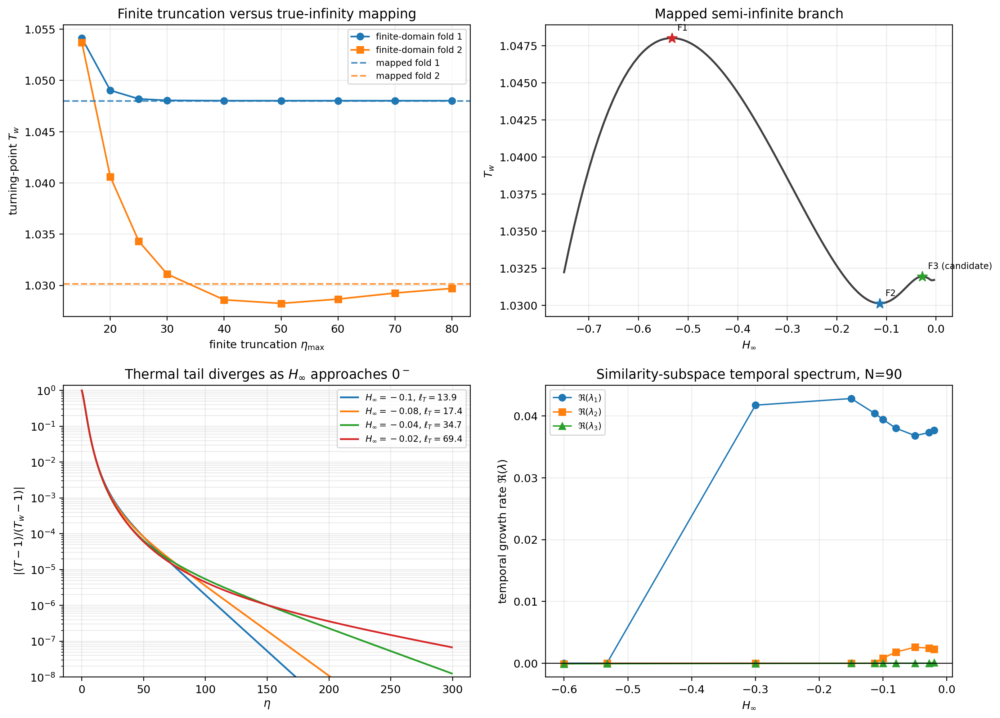

# von Kármán 半无限域第二鞍结与上支物理意义

## 结论先行

采用有理 Chebyshev 无穷远映射后，可以给出以下较可靠的判断。

1. **von Kármán 热边界层至少有两个真实的鞍结，而不是只有主鞍结。** 推荐临界值为

   $$
   \begin{aligned}
   \text{第一鞍结：}\quad
   H_{\infty,c1}&\approx-0.53276166,
   &T_{w,c1}&\approx1.048021731,\\
   \text{第二鞍结：}\quad
   H_{\infty,c2}&\approx-0.11331,
   &T_{w,c2}&\approx1.03014466.
   \end{aligned}
   $$

2. **有限截断域中上支延伸至较大壁温的现象，不能直接解释为半无限域中的物理解。** 真无穷远映射后，返回分支在第二鞍结处再次折回；靠近 $H_\infty=0$ 时，$T_w$ 只在约 $1.030$--$1.032$ 的窄区间内变化，并没有可靠地延伸到任意高温。

3. **第二鞍结没有使 von Kármán 上支恢复为稳定吸引态。** 第二鞍结处除了折叠零模态外，还存在一个约为 $+4.04\times10^{-2}$ 的实正时间特征值。越过第二鞍结后，典型上支解具有两个实正特征值。因此，它们是数学上成立但随时间不稳定的相似性平衡态。

4. **这种不稳定上支可以作为“非稳定平衡基本流”使用，但不能作为自然可观测的层流基态来解释首个失稳。** 如果以它做后续稳定性分析，必须明确基本流本身已经具有增长模态；所得中性曲线不能直接称为真实流动从稳定层流出发的临界曲线。

5. **双盘上支与 von Kármán 上支的物理地位不同。** 有限间隙双盘没有无穷远热衰减约束，而且此前的时间谱表明两个外支在轴对称相似性子空间内稳定。因此，双盘上支可以代表迟滞跃迁后的另一稳定状态；但这只是传统 Boussinesq 相似性模型内的物理可实现性，仍不等于完整三维流动和真实可压缩流体已得到验证。



---

## 1. 先澄清“两个鞍点”的术语

本问题中更准确的术语是两个 **saddle-node bifurcations**，即两个鞍结或折叠，而不是说轴向常微分方程相空间中只有两个普通鞍点。

鞍结的含义是：当控制参数变化时，两组稳态解在一个零特征值方向上相撞。局部标准形为

$$
\frac{\mathrm da}{\mathrm dt}
=c\mu+d a^2+\cdots,
$$

其中 $\mu$ 表示距临界参数的距离。折叠只控制一个临界方向；系统其余方向仍可能稳定，也可能已经不稳定。因此，“在第二鞍结处折叠模态发生稳定性交换”并不等价于“第二鞍结后的整组解稳定”。本次时间谱正好给出了这种反例。

---

## 2. 为什么必须采用真无穷远映射

### 2.1 基本流方程和远场条件

本次计算采用当前程序中的传统热离心 Boussinesq 相似性方程：

$$
\begin{aligned}
H'&=-2F,\\
F''&=F^2+HF'-(G-1)^2+(T-1),\\
G''&=2FG+HG'-2F,\\
T''&=\mathrm{Pr}\,H T'.
\end{aligned}
$$

圆盘处为

$$
H(0)=F(0)=G(0)=0,
\qquad T(0)=T_w,
$$

半无限远处为

$$
F(\infty)=0,
\qquad G(\infty)=1,
\qquad T(\infty)=1,
\qquad H(\infty)=H_\infty.
$$

这里用 $H_\infty$ 作为延拓坐标。这样即使 $T_w$ 在鞍结处折回，计算仍可沿整条解支继续。

### 2.2 有理 Chebyshev 映射

采用

$$
\eta=L\frac{1-x}{1+x},
\qquad -1\le x\le1,
$$

其中

$$
x=1\Longleftrightarrow\eta=0,
\qquad
x=-1\Longleftrightarrow\eta=\infty.
$$

导数变换为

$$
\frac{\mathrm d}{\mathrm d\eta}
=-\frac{(1+x)^2}{2L}
\frac{\mathrm d}{\mathrm dx}.
$$

因此数值网格真正包含 $\eta=\infty$，不需要在某个任意 $\eta_{\max}$ 处强迫 $T=1$。在 $x=-1$ 处，连续方程退化为已经给出的 $F(\infty)=0$；计算用映射正则性条件

$$
H_x(-1)=0
$$

替换该重复方程。

### 2.3 热尾为什么会使有限域产生误判

令

$$
\theta=T-1.
$$

远场中 $H\to H_\infty$，温度方程线性化为

$$
\theta''\simeq\mathrm{Pr}\,H_\infty\theta'.
$$

其衰减尺度为

$$
\ell_T=\frac{1}{\mathrm{Pr}|H_\infty|}.
$$

对当前 $\mathrm{Pr}=0.72$，有

| $H_\infty$ | $\ell_T$ |
|---:|---:|
| $-0.10$ | $13.89$ |
| $-0.08$ | $17.36$ |
| $-0.04$ | $34.72$ |
| $-0.02$ | $69.44$ |
| $-0.01$ | $138.89$ |
| $-0.004$ | $347.22$ |

当 $H_\infty\to0^-$ 时，热尾长度发散。若在有限位置强制 $T(\eta_{\max})=1$，外边界就会落进热调整区，数值问题实际加入了一个并不存在的有限距离冷边界。

更重要的是，在 $H_\infty=0$ 时，远场温度方程变成

$$
\theta''=0.
$$

若同时要求 $T(\infty)=1$ 且解有界，则只能得到远场常值；它不能在 $T_w\ne1$ 时保持非平凡的半无限域连接。因此 $H_\infty\to0^-$ 是一个**非一致奇异极限**：每个负的 $H_\infty$ 都可有衰减解，但极限点本身不再容许相同的非等温连接。

---

## 3. 两个已确认鞍结及收敛性

### 3.1 严格残差交叉收敛

第二鞍结使用条件数较好的 $N=50,60,70$ 和 $L=8,12$ 交叉验证。较高阶的双精度稠密微分矩阵虽然残差看似很小，但条件数上升，临界值末几位会受残差容差影响；因此报告没有盲目采用最高阶结果。

| 折叠 | 状态 | $H_\infty$ 中位值 | 网格间范围 | $T_w$ 中位值 | 网格间范围 |
|---|---|---:|---:|---:|---:|
| 第一鞍结 | 已确认 | $-0.532761657$ | $[-0.532761693,-0.532761595]$ | $1.04802173123$ | $[1.04802173123,1.04802173127]$ |
| 第二鞍结 | 已确认 | $-0.11330573$ | $[-0.11332686,-0.11330333]$ | $1.0301446639$ | $[1.0301446548,1.0301446644]$ |

据此，正文中第二鞍结建议只写

$$
H_{\infty,c2}\approx-0.11331,
\qquad
T_{w,c2}\approx1.03014466,
$$

而不要给 $H_{\infty,c2}$ 过多无意义的小数位。

### 3.2 有限域第二折返点为何曾经漂移

有限截断域的结果为

| $\eta_{\max}$ | 第二折返点 $H_\infty$ | 第二折返点 $T_w$ |
|---:|---:|---:|
| 15 | $-0.33989$ | $1.05372$ |
| 20 | $-0.24203$ | $1.04060$ |
| 30 | $-0.17427$ | $1.03110$ |
| 40 | $-0.13810$ | $1.02859$ |
| 60 | $-0.10055$ | $1.02866$ |
| 80 | $-0.09901$ | $1.02970$ |
| 真无穷远映射 | $-0.11331$ | $1.03014466$ |

第一鞍结随着 $\eta_{\max}$ 增大很快收敛；第二折返点却先漂移、再回摆。这不是第二鞍结不存在，而是有限外边界与不断增长的热尾相互作用。真无穷远映射消除了外边界位置这一任意参数，并在不同 $L$ 和谱阶数上恢复出一致的第二鞍结。

### 3.3 更靠近 $H_\infty=0$ 的结构

所有主映射配置还显示出第三个局部极大值，大致位于

$$
H_\infty\approx-0.0276,
\qquad
T_w\approx1.031960.
$$

时间谱也出现与该折返相符的新近零模态和不稳定方向计数变化。这说明它很可能是真实的附加鞍结，而不是随机噪声。但是，该区域满足 $\ell_T\gtrsim50$，并快速进入 $H_\infty\to0^-$ 的奇异极限；更靠近零处还出现对阶数和映射尺度更敏感的小振荡。因此当前最稳妥的措辞是：

> 前两个鞍结已经确认；真无穷远映射还提示近 $H_\infty=0$ 区域可能存在更多折返或折叠序列，但其最终拓扑需要高精度算术和伪弧长延拓进一步确定。

所以不宜把“恰好只有两个鞍结”写成最终结论，更可靠的是“至少两个已确认鞍结”。

---

## 4. 上支的时间稳定性

本次谱分析允许扰动保持轴对称相似性形式，写为

$$
\{f(\eta),g(\eta),h(\eta),\vartheta(\eta)\}
\exp(\lambda t).
$$

它判断的是相似性子空间内的物理时间增长率，而不是完整三维稳定性。若 $\Re(\lambda)>0$，相应扰动随时间增长；这里的主导不稳定特征值均为实数，因而是单调失稳而非 Hopf 振荡。

以时间谱阶数 $N_t=90$ 为例：

| 分支位置 | $H_\infty$ | $T_w$ | 折叠外的主要正特征值 | 结论 |
|---|---:|---:|---:|---|
| 主支样本 | $-0.60$ | $1.04676$ | 无 | 相似性子空间内稳定 |
| 第一鞍结 | $-0.532762$ | $1.04802$ | 无；$\lambda_0\simeq0$ | 稳定主支与不稳定返回支相撞 |
| 返回中支 | $-0.30$ | $1.03858$ | $+0.04176$ | 一个实不稳定方向 |
| 第二鞍结前 | $-0.15$ | $1.03067$ | $+0.04283$ | 一个实不稳定方向 |
| 第二鞍结 | $-0.11331$ | $1.03014$ | $+0.04044$，另有 $\lambda_0=\mathcal O(10^{-7})$ | 折叠发生时整支已不稳定 |
| 第二鞍结后 | $-0.10$ | $1.03022$ | $+0.03945,+0.000813$ | 两个实不稳定方向 |
| 上支样本 | $-0.08$ | $1.03061$ | $+0.03803,+0.001794$ | 两个实不稳定方向 |
| 上支样本 | $-0.05$ | $1.03156$ | $+0.03683,+0.002582$ | 两个实不稳定方向 |

因此第二鞍结的作用是让**一个折叠模态**穿过零，但原来约 $0.04$ 的不稳定模态没有消失。越过折叠后，折叠模态本身又成为新的正特征值，导致不稳定方向从一个增加到两个。

这也解释了一个容易混淆的问题：

> 第二鞍结证明了解支的全局拓扑，但它没有提供一个可吸引真实时间演化的高温层流状态。

---

## 5. “临界壁温处相似性解失效”到底是什么意思

“相似性解失效”需要拆成三种不同说法。

### 5.1 主分支终止

从等温解连续升高 $T_w$ 时，物理路径首先沿稳定主支前进。在第一鞍结

$$
T_w\approx1.048021731
$$

处，稳定主支和返回的不稳定支相撞。此后若仍要求沿同一条等温连接分支持续增大 $T_w$，附近不再有稳态相似性解。这是“主分支失去存在性”的严格含义。

### 5.2 稳态方程并没有整体失效

在鞍结处，方程本身仍然有解；只是以 $T_w$ 为单向控制参数的普通牛顿求解器遇到奇异 Jacobian，分支随即向较小的 $T_w$ 折回。改用 $H_\infty$ 或伪弧长作为延拓参数，就能继续跟踪这条返回支。

因此不能写成“$T_w>1.048$ 后传统模型的所有相似性解都不存在”。正确写法应是：

> The stable isothermal-connected similarity branch terminates in a saddle-node at $T_w\simeq1.04802$.

### 5.3 有解不等于可被时间演化选中

稳态边值问题回答“是否存在精确平衡态”；时间谱回答“小扰动是否会回到该平衡态”。返回支和第二鞍结后的上支虽然满足方程和边界条件，但具有正时间特征值，任意小的相似性扰动都会使系统离开这些平衡态。

---

## 6. 上支是不是物理解，能否作为基本流

“物理解”不是单一的是非判断，至少应分四层。

| 层次 | 判断问题 | von Kármán 第二鞍结后上支 |
|---|---|---|
| 数学存在性 | 是否满足方程、真无穷远条件和网格收敛 | 对 $H_\infty<0$ 的已计算区间，是 |
| 时间稳定性 | 小扰动是否衰减 | 否；至少有两个实正模态 |
| 动力学可达性 | 从稳定等温主支缓慢升温能否自然到达 | 通常不能；第一鞍结后会离开原平衡 |
| 模型真实性 | 传统 Boussinesq 闭合在该温差下是否代表真实流体 | 尚未由当前计算证明 |

### 6.1 可以使用它的情况

上支可以作为以下研究中的基本流：

- 研究鞍结的中心流形、零模态和不稳定流形；
- 研究非稳定平衡态如何组织相空间；
- 作为 edge state 或瞬态轨道附近的参考态；
- 比较不同闭合模型是否保留相同的非稳定分支拓扑；
- 计算在外部反馈控制下可能被稳定化的状态。

此时应称为 **unstable equilibrium base state**，并同时报告其已有的不稳定特征值。

### 6.2 不宜使用它的情况

如果研究目标是“真实稳定层流首先在什么参数下发生三维失稳”，则不应把该上支直接当作自然层流基本流。原因是：

1. 它在最受限的轴对称相似性子空间内已经失稳；
2. 完整三维扰动集合只会增加可能的失稳方向，不能消除已经存在的相似性不稳定方向；
3. 在其上计算出的 Type I/II 或其他中性曲线是“一个已经不稳定平衡态的次级谱”，不是从稳定层流出发的首个临界条件。

因此，若论文仍展示这类中性曲线，必须把“基本流折叠失稳”和“其上的三维模态失稳”分层讨论，不能把后者误称为物理首发失稳。

---

## 7. 为什么双盘上支可能有物理意义，而 von Kármán 上支没有同等意义

### 7.1 半无限域 von Kármán

von Kármán 的闭合依赖

$$
T(\infty)=1,
\qquad H_\infty<0,
$$

即轴向抽吸必须把热扰动送向远场并使其指数衰减。上支向 $H_\infty=0$ 靠近时，这一输运机制逐渐消失，热调整位置被推到越来越远的地方。所谓“上支向很远处延伸”，主要是在延拓坐标和热尾长度上的延伸，不是一个可以稳定维持任意高 $T_w$ 的新层流态。

当前真无穷远结果尤其表明：先前有限域中明显向高 $T_w$ 延伸的部分受到人为冷外边界控制，不能当作半无限域物理解的证据。

### 7.2 有限间隙 rotor--stator

双盘系统的热边界由两个真实壁面给定，没有 $\eta\to\infty$ 热尾，也没有 $H_\infty\to0^-$ 的远场奇异约束。系统可以通过径向压力梯度 $\Pi$、零净径向流约束、旋转核心和静子边界重新分配环流。

此前在 $\mathrm{Re}_h=1000$ 的时间谱中：

- 两个外支在轴对称相似性子空间内稳定；
- 中支具有一个实正特征值；
- 两个折叠分别位于 $T_w\approx1.15552$ 和 $T_w\approx1.16768$；
- 因而存在模型内的双稳态和迟滞窗口。

所以双盘上支的物理意义可以是：稳定主支在一个折叠处消失后，时间演化跳到另一个稳定的有限间隙循环状态。这是一种真实的动力系统机制，而不是单纯的牛顿求解器补支。

但仍要加三项限定：

1. “稳定”目前只在轴对称相似性子空间内成立；
2. 双盘相似性模型仍没有有限半径、侧壁和完整三维扰动；
3. 传统 Boussinesq 模型在大温差下的定量有效性不能由分支稳定性自行证明。

因此，双盘上支是“模型内可实现的候选物理状态”，而 von Kármán 映射上支是“数学上成立但当前谱显示不可吸引的非稳定平衡态”。二者不能因为都叫上支就赋予相同物理含义。

---

## 8. 对论文论证的直接建议

当前结果最适合支持以下逻辑。

1. **主结论不是求解器在 $T_w\approx1.048$ 处坏掉，而是稳定、等温连接的 von Kármán 基本流发生鞍结终止。**
2. **真无穷远映射确认返回支上还存在第二鞍结，说明第一鞍结属于完整的非线性分支拓扑。**
3. **第二鞍结并没有提供一个稳定的高温 von Kármán 基本流；上支仍有一个原有不稳定模态，并新增折叠不稳定模态。**
4. **有限间隙双盘能够形成稳定上支和迟滞，而半无限域上支不能，这说明几何闭合决定了异常分支能否成为可实现状态。**
5. **两个几何都出现鞍结仍然是传统热离心闭合的重要警告，但“鞍结后发生什么”必须由全局分支和时间稳定性共同决定。**

建议避免以下过强表述：

- “von Kármán 上支可以延伸到任意大壁温”；
- “第一临界壁温以后所有相似性解都消失”；
- “只要数学上有上支，就可以用作可观测层流基本流”；
- “相似性子空间稳定已经证明完整三维流动稳定”。

更严谨的英文概括可写为：

> A rational-Chebyshev compactification confirms a second saddle-node on the returned semi-infinite von Kármán branch. This turning point does not restore a dynamically attracting basic state: a pre-existing real unstable mode persists at the fold and the post-fold branch carries two unstable similarity modes. Apparent continuation to much higher wall temperatures on finite truncations is instead tied to the singularly long thermal tail as $H_\infty\to0^-$. In contrast, confinement permits a dynamically stable outer branch and hysteretic state selection in the rotor--stator similarity system.

---

## 9. 数据和复现

原有限域数据只读；所有新结果均位于 `TwoDisk/vonkarman_infinite_mapping/`。

主要文件：

- `confirmed_fold_summary.csv`：严格残差交叉收敛后的鞍结汇总；
- `upper_branch_stability_summary.csv`：关键分支位置的时间谱摘要；
- `convergence_full/fold_convergence.csv`：不同映射尺度和谱阶数的原始折返点；
- `stability_N110_L8/mapped_temporal_samples.csv`：$N_t=50,70,90$ 的原始谱数据；
- `upper_branch_infinite_mapping_summary.png`：有限域漂移、映射分支、热尾和时间谱汇总图；
- `analyze_vonkarman_infinite_mapping.py`：无穷远映射、延拓和时间谱程序；
- `summarize_vonkarman_infinite_mapping.py`：结果汇总与作图程序。

从 `TwoDisk` 目录复现主映射和谱计算：

```bash
OPENBLAS_NUM_THREADS=1 OMP_NUM_THREADS=1 \
python3 analyze_vonkarman_infinite_mapping.py \
  --degree 110 --scale 8 --h-stop -0.02 \
  --tolerance 3e-10 --temporal-degrees 50 70 90 \
  --output-dir vonkarman_infinite_mapping/stability_N110_L8
```

重新生成摘要和图：

```bash
OPENBLAS_NUM_THREADS=1 OMP_NUM_THREADS=1 \
python3 summarize_vonkarman_infinite_mapping.py
```
