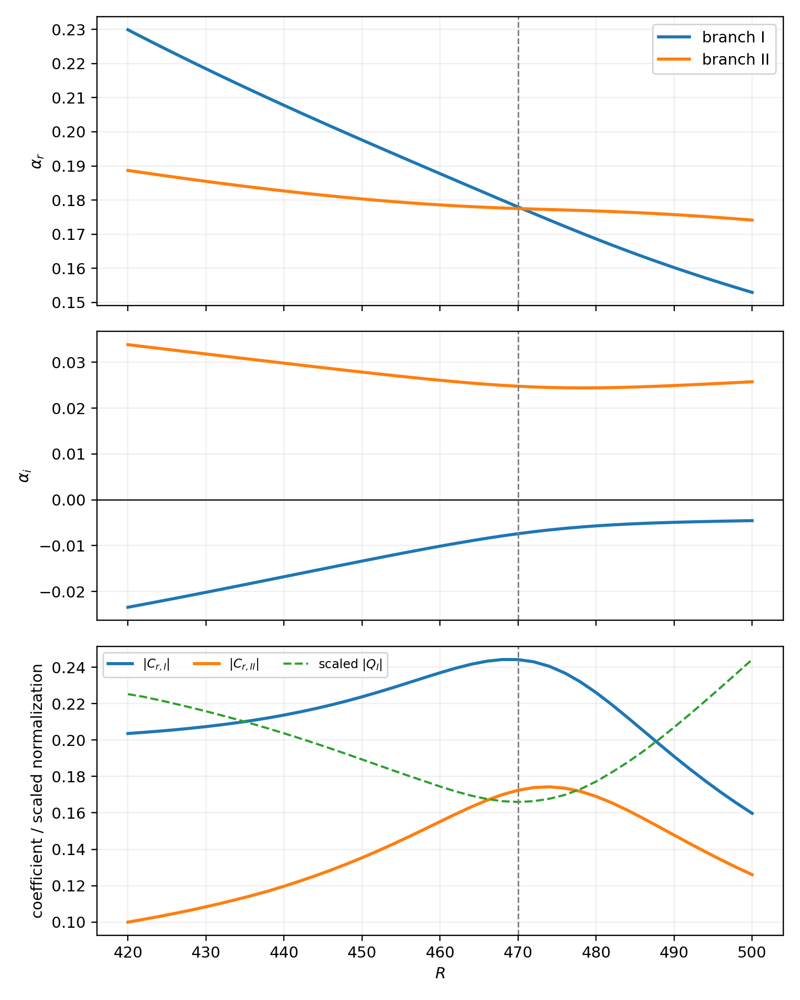

# Referee 3 C6–C7 计算程序验证报告

## 1. 本轮范围

本轮仅验证计算程序并生成数值证据，没有修改 manuscript、TeX 或 response-to-reviewers 文件。计算针对 Referee 3 的 C6 和 C7，统一采用

\[
a_s=0,\qquad Re_h=1000,\qquad \bar{\omega}=0,\qquad n=30,
\]

并使用 Chebyshev 多项式阶数 `N=99`（100 个配置点）。现有网格无关性数据表明，在代表性 Type-I 模态上，100 个配置点相对于 300 点参考结果的复特征值相对误差约为 `1.90e-8`。

壁面激励参数已与现有计算结果统一为：`h_r=1/Re_h=0.001`、`c^2=1`。对于程序中使用的 Fourier 表达

\[
\hat h(\alpha)=h_r\sqrt{\frac{\pi}{l_s}}\exp\left(-\frac{\alpha^2}{4l_s}\right),
\]

有 `l_s=1/(2c^2)=0.5`，本轮 C6 和 C7 均使用该值。一致性检查表明，在 `R=470`时 `N=99` 得到 `|C_r|=0.244259`，与正文曲线的峰值约 `0.25` 一致；`N=129` 的对应结果为 `0.243423`。

## 2. C6：三个激励位置传播至绝对不稳定临界半径

### 2.1 方法

固定 `n=30` 和 `omega_bar=0`，沿同一条不稳定空间分支取

\[
\beta(R)=\frac{n}{R},\qquad \omega(R)=0,
\]

并计算

\[
N(R_t;R_f)=-\int_{R_f}^{R_t}\alpha_i(\xi)\,\mathrm d\xi,
\qquad
|A(R_t;R_f)|=|C_r(R_f)|\exp[N(R_t;R_f)].
\]

共同目标半径为 `R_t=R_abs=570`。程序自动得到下中性点

\[
R_l=287.82160889,\qquad
\alpha(R_l)=0.449677971-4.32e-15\mathrm i.
\]

沿程最大增长率位于 `R_g≈372.98889`，全局感受性峰值位于 `R_p≈468.90953`。

需要特别说明：当前重新计算的 `C_r(R)` 在 `R≈360` 附近仍然单调增加，没有形成严格的局部极值。因此，三组主比较采用“下中性点、最大增长率附近的局部 case、全局感受性峰值”。另外保留 `R=360` 的定点计算，以检查用户建议位置对结论的影响。

### 2.2 数值结果

| 激励位置 | `R_f` | `|C_r(R_f)|` | `N(570;R_f)` | `exp(N)` | `|A(570)|` |
|---|---:|---:|---:|---:|---:|
| 下中性点 | 287.82161 | 0.143595 | 4.336003 | 76.401535 | 10.970872 |
| 最大增长率附近 | 372.98889 | 0.193957 | 2.544599 | 12.738115 | 2.470641 |
| 全局感受性峰值 | 468.90953 | 0.244415 | 0.426114 | 1.531295 | 0.374271 |
| 固定 R=360 检查 | 360.00000 | 0.187253 | 2.959945 | 19.296919 | 3.613415 |

下中性点的局部耦合系数最小，但其放大距离最长，最终振幅最大：

- 相对最大增长率附近激励，下中性点激励的 `|A(570)|` 大约高 `4.44` 倍；
- 相对全局 `C_r` 峰值处激励，大约高 `29.31` 倍；
- 即使固定采用 `R=360`，下中性点激励的最终振幅仍高 `3.04` 倍。

因此，这组线性计算支持审稿人 C6 的核心物理判断：局部最大的感受性系数并不意味着抵达下游时的扰动振幅最大；较早激励获得的累计指数放大可以完全超过初始耦合系数的劣势。

### 2.3 径向积分验证

以下比较仅改变积分/续接步长，并使用相同的 `R_l` 与正确的初始特征值移位：

| `ΔR` | `N(570)` | `exp(N)` | `|A(570)|` | 相对 `ΔR=1` 差异 |
|---:|---:|---:|---:|---:|
| 1 | 4.336183921 | 76.415375116 | 10.972859471 | 0.000e+00 |
| 2 | 4.336002781 | 76.401534506 | 10.970872029 | 1.811e-04 |
| 4 | 4.335278196 | 76.346195160 | 10.962925581 | 9.053e-04 |

`ΔR=2` 的最终振幅相对 `ΔR=1` 相差 `1.811e-04`，可作为本轮兼顾速度和精度的设置。

## 3. C7：两支模态在切换区的诊断

### 3.1 复特征值是否合并

在 `420≤R≤500` 内分别求解两条特征值分支。在 `R=470` 时，两支实部最接近：

\[
\alpha_I=0.177998574-0.007406715\mathrm i,
\]

\[
\alpha_{II}=0.177519053+0.024768122\mathrm i.
\]

对应差异为

\[
\Delta\alpha_r=4.795e-04,\qquad
\Delta\alpha_i=3.217e-02,\qquad
|\Delta\alpha|=3.218e-02.
\]

这验证了审稿人的判断：两支模态的实部几乎相同，但完整复特征值并不相等，也不存在由当前数据支持的严格特征值合并。

### 3.2 感受性峰值来自哪里

在 `R=470`：

| 分支 | `|C_r|` | `|Q|` | `|BC|` |
|---|---:|---:|---:|
| I | 0.244259 | 3.577534e-04 | 8.738441e-05 |
| II | 0.172435 | 3.202958e-04 | 5.523015e-05 |

沿主响应分支，`|BC|` 在切换区只缓慢变化，而 `|Q|` 明显减小，因此

\[
|C_r|=\frac{|BC|}{|Q|}
\]

中的小分母效应是 `C_r` 上升并形成峰值的主要直接原因。峰值位置同时与两支特征值实部接近的区域重合，但不能据此声称复特征值发生合并。

### 3.3 模态命名的证据等级

当前计算可以可靠地称这两条曲线为“two distinct spatial eigenvalue branches”，并证明其实部接近、虚部不同。现有的单一分量峰值位置诊断不足以独立、无歧义地把每一点都物理标记为 Type I 或 Type II；正式用于论文前，建议把两个分支的完整直接/伴随特征函数与文中已经确认的 Type-I/Type-II 参考模态做加权重叠比较。故本报告不把尚未完成的形状标签当作最终证据。

## 4. 程序验证中发现的注意事项

1. `total_amplitude.jl` 自动寻找下中性点时能正确进入目标不稳定分支。若直接提供 `--lower-radius`，还必须同时给出接近目标根的 `--alpha-real≈0.44968`；否则默认移位 `1.05` 会收敛到另一条稳定分支，产生完全错误的 N 因子。
2. `N=99` 在现有网格验证中已经足够；本轮 C6/C7 的 Hermitian-adjoint 特征值配对误差均保持在约 `1e-11` 或更小。
3. 粗糙元宽度已统一为 `c^2=1`与 `l_s=0.5`。该参数能够复现正文现有的 `C_r` 曲线；相比之下，若使用 `c^2=4` 对应的 `l_s=0.125`，`R=470` 处会得到 `|C_r|≈0.466`，与正文图中约 `0.25` 的峰值不符。
4. 总振幅采用局部平行、线性 `e^N` 传播，没有包含非平行幅值输运、群速度修正或非线性饱和；因此它适合比较 C6 中不同激励位置的相对结果，不应直接解释为转捩概率。

## 5. 对审稿意见的证据结论

### C6

证据强度已经达到可以回应审稿人的水平：下中性点激励尽管初始 `C_r` 较小，但到 `R_abs=570` 时的线性总振幅显著大于最大增长率附近和全局局部感受性峰值处的激励。这说明原来的局部 `C_r` 峰值不能单独代表下游危险程度。

### C7

两条模态分支在 `R≈470` 的实部近乎相同，但虚部明显不同。`C_r` 的峰值主要与 `Q` 的下降有关，而不是 `BC` 的同步尖峰。正式表述应使用“dominant-response/branch interaction or switching region”，避免声称两个复特征值完全相等或发生严格合并。

## 6. 生成文件

- C6 主数据：`c6_validation_results/c6_branch_and_receptivity.dat`
- C6 报告采用的三/四个 case：`c6_validation_results/c6_three_cases_reported.dat`
- C6 Julia 原始 case 输出：`c6_validation_results/c6_three_cases.dat`
- C6 图：`c6_validation_results/c6_three_case_validation.png`
- C7 两分支数据：`c7_validation_results/c7_two_branches.dat`
- C7 图：`c7_validation_results/c7_two_branch_diagnostics.png`
- 本报告：`REFEREE3_C6_C7_COMPUTATION_VALIDATION_REPORT.md`
